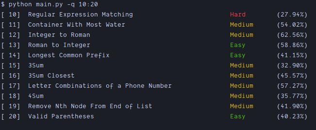

> **_leetcode.py_** is a Python command-line tool that simplifies your LeetCode journey by providing a seamless interface to access and solve LeetCode problems effortlessly.

## Features

* **Problem Fetching:** LeetCode.py fetches the problem details directly from ~~`leetcodeDb.json`~~ LeetCode's official API, allowing you to access all the necessary information about a problem.

* **Code Snippet Retrieval:** With LeetCode.py, you can easily retrieve code snippets for a specific problem.

* **Code Editing:** You can modify and edit the code directly within the terminal, saving you the hassle of switching between multiple applications.

* **ASCII Art:** LeetCode.py provides a beautiful ASCII art for each problem, making your coding experience more enjoyable.

* **Language Support:** LeetCode.py supports ~~only **Python**~~ all languages except Python2.

### Installation
```
git clone https://github.com/hrdkmishra/leetcode.py.git
cd leetcode.py
python3 -m venv venv
source venv/bin/activate
pip install -r requirements.txt
```

### Usage

#### note: `lc.py --lib` for fixing python-leetcode lib issue

First you need to enter your leetcode session and crsf token
```
python lc.py
```
to fetch the problem
```
python lc.py -q/--question <question_number>
```


to fetch problems in range (might not work always)
```
python lc.py -q/--question <question_number>:<question_number>
```


to solve the problem
```
python lc.py -s/--solve <question_number>
```


to test the code
```
python lc.py -t/--test code_editor/filename
```

to submit the code
```
python lc.py -u/--submit code_editor/filename
```

## Features to be added

1. [x] code submission
2. [x] testing the user code
3. [x] code submission status
4. [x] code submission result
5. [x] code submission result details
6. [x] -h/--help
7. [ ] color theme
8. [x] fixed python-leetcode lib issue
9. [x] add support for other languages except python2

