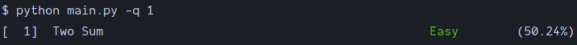
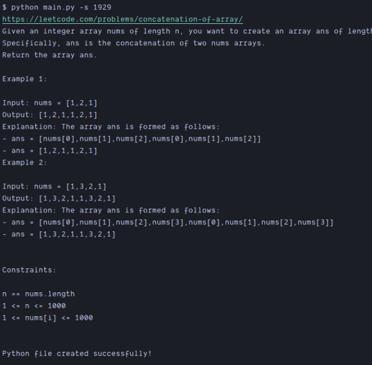

> **_leetcode.py_** is a Python command-line tool that simplifies your LeetCode journey by providing a seamless interface to access and solve LeetCode problems effortlessly.

## Features

* **Problem Fetching:** LeetCode.py fetches the problem details directly from `leetcodeDb.json` ~~LeetCode's official API, allowing you to access all the necessary information about a problem~~.

* **Code Snippet Retrieval:** With LeetCode.py, you can easily retrieve code snippets for a specific problem.

* **Code Editing:** You can modify and edit the code directly within the terminal, saving you the hassle of switching between multiple applications.

* **ASCII Art:** LeetCode.py provides a beautiful ASCII art for each problem, making your coding experience more enjoyable.

* **Language Support:** LeetCode.py supports only **Python**.

### Installation
```
git clone https://github.com/hrdkmishra/leetcode.py.git
cd leetcode.py
pip install -r requirements.txt
```

### Usage

First you need to enter your leetcode session and crsf token
```
python leetcode.py
```
to fetch the problem
```
python leetcode.py -q/--question <question_number>
```

to fetch problems in range
```
python leetcode.py -q/--question <question_number>:<question_number>
```

to solve the problem
```
python leetcode.py -s/--solve <question_number>
```


## Features to be added

1. [ ] code submission
2. [ ] testing the user code
3. [ ] code submission status
4. [ ] code submission result
5. [ ] code submission result details
6. [ ] -h/--help
7. [ ] color theme
